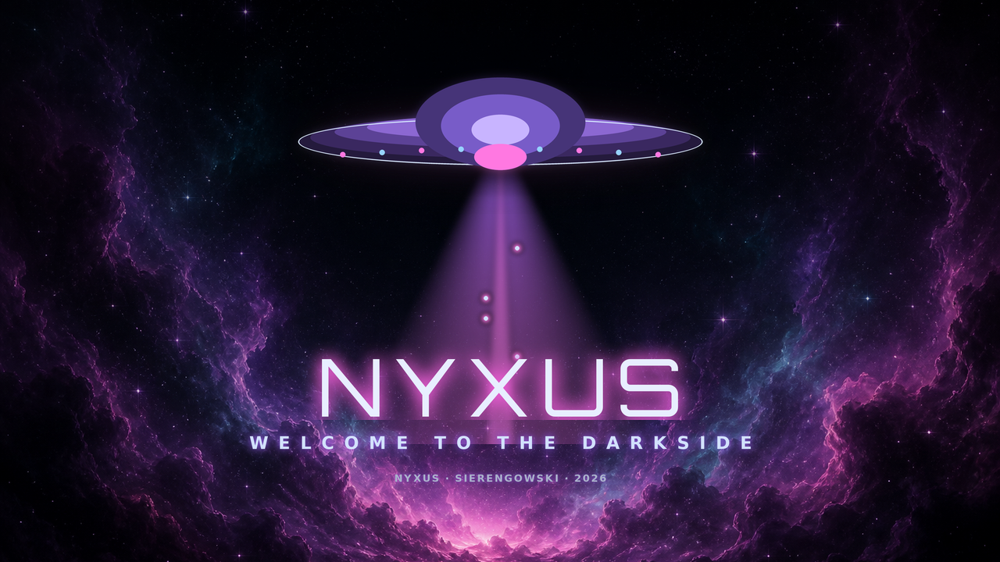

# NYXUS · Plymouth Boot Splash — "COSMIC ARRIVAL"

> A UFO descends out of a violet/magenta nebula, fires a tractor beam, and
> materialises the **NYXUS** wordmark. The cinematic bridge:
> **BIOS → themed Plymouth UFO animation → greeter (regreet) → desktop.**
>
> © 2026 Joseph A. Sierengowski · NYX-J5W-2026-SIERENGOWSKI-LOCKED



*(`_preview.png` is a static PIL composite of the "arrived" frame — a design
mockup. The real thing is animated by Plymouth at boot.)*

---

## What this is

A **script-type** Plymouth theme (`ModuleName=script`). Plymouth's scripting
engine animates layered PNG sprites, which is what makes the descent, hover,
tractor beam, rising orbs and text reveal possible — an image-sequence theme
can't do interactive LUKS prompts or resolution-independent motion.

### The cinematic (time-based, ~50 fps)

| beat | what happens |
|------|--------------|
| 0.0–0.3s | nebula fades up from black |
| 0.2–1.4s | saucer glides down from deep space, ease-out into a gentle hover |
| 1.2–1.9s | arrival glow blooms, **tractor beam** opens beneath the saucer |
| ongoing  | glowing **orbs stream up the beam** — this is the "loading" pulse |
| 1.7–2.3s | **NYXUS** wordmark materialises in the beam light (fade + rise) |
| 2.2–3.2s | tagline `WELCOME TO THE DARKSIDE` + subline fade in |
| LUKS     | passphrase prompt draws under the wordmark; keystrokes = a row of beam-orbs |
| quit     | everything fades to black for a **flash-free greeter handoff** |

The reveal is **time-based**, not boot-progress-based, so it looks identical on
a 2-second SSD boot and a slower one (the animation simply gets cut off cleanly
by the fade-to-black quit when the greeter takes over).

---

## Files

| file | role | committed / installed |
|------|------|-----------------------|
| `nyxus.plymouth`  | theme manifest (`ModuleName=script`) | ✅ / ✅ |
| `nyxus.script`    | the animation (Plymouth scripting language) | ✅ / ✅ |
| `background.png`  | 1920×1080 cosmic nebula plate (cover-fit) | ✅ / ✅ |
| `saucer.png`      | glowing metallic saucer, alpha | ✅ / ✅ |
| `saucer_glow.png` | soft arrival bloom, alpha | ✅ / ✅ |
| `beam.png`        | tractor-beam cone, violet→magenta, alpha | ✅ / ✅ |
| `orb.png`         | rising beam particle / LUKS bullet, alpha | ✅ / ✅ |
| `wordmark.png`    | **NYXUS** in Orbitron with magenta glow, alpha | ✅ / ✅ |
| `tagline.png`     | `WELCOME TO THE DARKSIDE`, alpha | ✅ / ✅ |
| `subline.png`     | `NYXUS · SIERENGOWSKI · 2026`, alpha | ✅ / ✅ |
| `gen_nyxus_boot_art.py` | regenerates every PNG above | ✅ / ❌ (build-only) |
| `_nebula_source.png` | rendered nebula source plate for the generator | ✅ / ❌ (build-only) |
| `_preview.png`    | static design mockup for this README | ✅ / ❌ (build-only) |

The installer copies only `*.plymouth`, `*.script` and `*.png` **not** starting
with `_` — so the build-only art never lands in `/usr/share`.

---

## How the frames were made

- **Nebula backdrop** — a rendered cosmic plate (violet/magenta clouds, dark
  negative space up top for the descent and in the centre for text). Stored as
  `_nebula_source.png`; the generator cover-fits it to 1920×1080 and deepens the
  top so the saucer reads against dark space → `background.png`.
- **Everything with alpha** (saucer, glow, beam, orb, and the Orbitron wordmark
  / DejaVu tagline / subline) is drawn **procedurally with Pillow + numpy** in
  `gen_nyxus_boot_art.py`. Procedural = true clean alpha, tiny files, and
  resolution-independent positioning driven from the live screen size in the
  Plymouth script.
- **Wordmark font** is the on-brand **Orbitron** already installed at
  `~/.local/share/fonts/nyxus/Orbitron.ttf`.

Re-render any time:

```bash
python3 gen_nyxus_boot_art.py            # uses _nebula_source.png
python3 gen_nyxus_boot_art.py my-neb.png # or supply a different nebula plate
```

---

## Install it (needs root — run these yourself)

```bash
sudo bash /home/nyx/Nyxus-Core/scripts/nyxus-setup-plymouth.sh
sudo reboot
```

That's it. The setup script is idempotent, backs up every file it touches as
`*.nyxus-bak`, and verifies each step. **The splash is only visible after you
reboot** — it's a boot-time animation.

### Preview without rebooting (optional)

```bash
sudo plymouthd
sudo plymouth --show-splash
sleep 8
sudo plymouth quit
```

---

## This machine's boot setup (auto-detected)

- **Bootloader:** `systemd-boot` (UEFI, Secure Boot off) — **no GRUB**.
- **Kernel image:** a **UKI** (Unified Kernel Image) at
  `/boot/EFI/Linux/arch-linux.efi`, built by **mkinitcpio** via
  `/etc/mkinitcpio.d/linux.preset` (`default_uki=`).
- **Kernel cmdline source:** `/etc/kernel/cmdline` — it is baked *into* the UKI,
  so `quiet splash` must be added there (NOT to GRUB, which doesn't exist here),
  and the UKI must be rebuilt.
- **Initramfs generator:** `mkinitcpio` (not dracut). The `plymouth` hook goes
  into `HOOKS=` right after `kms`.

The setup script detects all of the above and takes the right path
automatically. It also handles the other two common layouts (systemd-boot
type-#1 `loader/entries/*.conf`, and GRUB via `/etc/default/grub` +
`grub-mkconfig`) for portability across NYXUS installs.

### The exact edits it makes on this box

1. `/etc/mkinitcpio.conf` — `HOOKS=(… kms **plymouth** keyboard …)`
2. `/etc/kernel/cmdline`  — appends `quiet splash`
3. `/etc/plymouth/plymouthd.conf` — `Theme=nyxus`, `ShowDelay=0`
4. `plymouth-set-default-theme -R nyxus` → runs `mkinitcpio -P` → **rebuilds the
   UKI** with the plymouth hook + new cmdline embedded.

### Revert

Restore the `*.nyxus-bak` copies and rebuild:

```bash
sudo cp /etc/mkinitcpio.conf.nyxus-bak /etc/mkinitcpio.conf
sudo cp /etc/kernel/cmdline.nyxus-bak  /etc/kernel/cmdline
sudo mkinitcpio -P
```

---

## Clean handoff to the greeter (no text flash)

The greeter (`regreet` under `greetd`) runs on **VT1** — the same VT Plymouth
draws on. Two things keep the `Plymouth → greeter → desktop` transition clean:

1. **This theme fades to black on quit** (`QuitCallback`), so Plymouth never
   leaves saucer/text artefacts on the VT as the greeter takes the DRM master.
2. **`nyxus-session-start`** (owned by the session/greeter work) already blanks
   the VT and redirects Hyprland's stdout/stderr to a log, so the
   `greeter → desktop` step doesn't dump the compositor banner as raw console
   text either.

Together: BIOS → **nebula/UFO splash** → regreet card → desktop, with a dark
fade at every seam instead of a flash of boot text.

> Optional polish (owned by the greeter setup, not this task): a systemd drop-in
> ordering `greetd.service` `After=plymouth-quit-wait.service` guarantees the
> splash is fully retained until the greeter is ready to paint. Not required for
> the splash itself to work.
